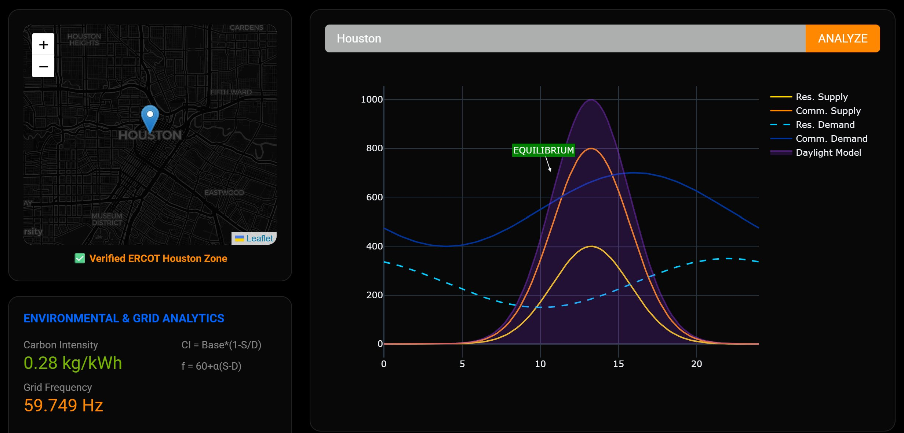

<p align="center">
  
</p>

<h1 align="center">Specusol — my individual hackathon repo</h1>

<p align="center">
  My personal working copy from <strong>EnergyHack @ Georgia Tech</strong> (January 2026) —
  my first hackathon, and my first time using Git, GitHub, and Render.
</p>

<p align="center">
  👉 <strong>For the complete, deployed product, see
  <a href="https://github.com/cindy-muniz/EnergyHack2026">EnergyHack2026</a></strong>
  — live at <a href="https://energyhack2026.onrender.com">energyhack2026.onrender.com</a>.
</p>

---

## About this repo

During the 36-hour hackathon, Jenna and I each built in our own repository, then merged our
features into the final deployed version ([EnergyHack2026](https://github.com/cindy-muniz/EnergyHack2026)).
This repo holds the parts I built:

- **ERCOT zone map** — my idea, and the first working implementation: lat/lon bounding boxes
  for the four ERCOT zones (pure Python, no geospatial dependencies) with address-to-zone
  lookup and pin-drop.
- **Supply/demand + daylight visualizations** — residential and commercial supply and demand
  curves across a 24-hour cycle, a Gaussian solar-irradiance model (peaking ~1:15 PM at
  ~1000 W/m²), and automatic equilibrium detection and annotation.



---

## Tech stack

| Layer         | Technology                              |
|---------------|------------------------------------------|
| Language      | Python 3                                 |
| Web framework | Plotly Dash + Dash Bootstrap Components  |
| Mapping       | Dash Leaflet                             |
| Data / math   | NumPy, Pandas                            |
| Geolocation   | Geopy / Nominatim                        |

---

## Run it locally

```bash
git clone https://github.com/cindy-muniz/Specusol.git
cd Specusol
pip install -r requirements.txt
python app.py
```

Then open `http://localhost:8050` in your browser.
